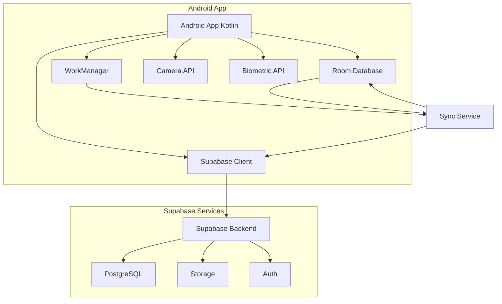
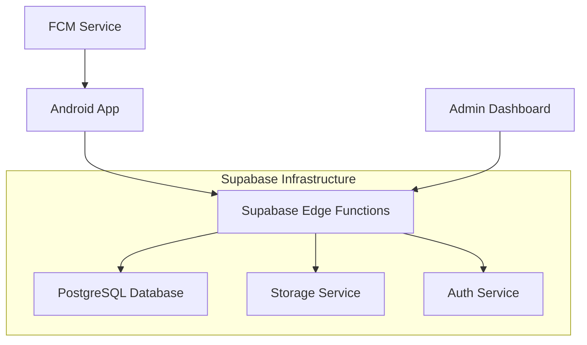
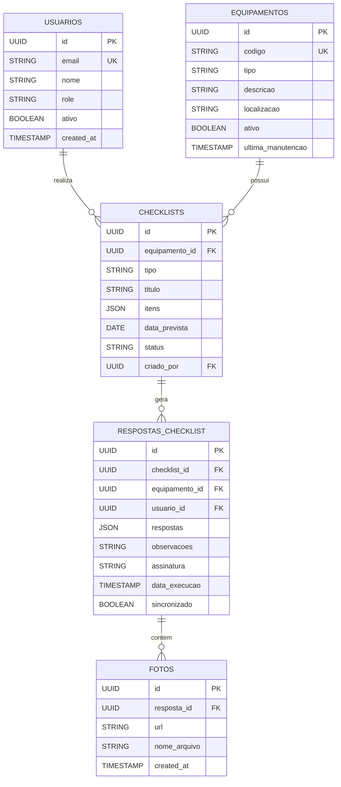

## 1. Arquitetura do Sistema



## 2. Descrição das Tecnologias

- **Frontend Mobile:** Kotlin + Android SDK 34 + Jetpack Compose
- **Banco Local:** Room Database + SharedPreferences
- **Sincronização:** WorkManager + Coroutines
- **Backend:** Supabase (PostgreSQL, Auth, Storage)
- **Notificações:** Firebase Cloud Messaging
- **Camera:** CameraX API
- **Autenticação:** Biometric API + Supabase Auth
- **Injeção de Dependências:** Hilt/Dagger

## 3. Definições de Rotas/Navegação

| Rota | Propósito |
|------|-----------|
| /login | Tela de autenticação com biometria |
| /dashboard | Dashboard principal com cards de checklists |
| /checklists | Lista de checklists pendentes e completados |
| /checklist/{id} | Tela de preenchimento do checklist |
| /equipamentos | Lista de equipamentos cadastrados |
| /equipamento/{id} | Detalhes do equipamento |
| /scanner | Scanner de QR code para equipamentos |
| /sincronizacao | Controle de sincronização e dados pendentes |
| /configuracoes | Preferências do app |
| /perfil | Informações do usuário |

## 4. Definições de APIs

### 4.1 APIs de Autenticação

```
POST /auth/v1/token
```

Request:
```json
{
  "email": "tecnico@empresa.com",
  "password": "senha123",
  "grant_type": "password"
}
```

Response:
```json
{
  "access_token": "eyJhbGc...",
  "token_type": "bearer",
  "expires_in": 3600,
  "refresh_token": "abcdef...",
  "user": {
    "id": "uuid-usuario",
    "email": "tecnico@empresa.com",
    "user_metadata": {
      "nome": "João Silva",
      "role": "tecnico"
    }
  }
}
```

### 4.2 APIs de Checklist

```
GET /rest/v1/checklists?usuario_id=eq.{id}&status=eq.pendente
```

Response:
```json
[
  {
    "id": "uuid-checklist",
    "equipamento_id": "uuid-equip",
    "tipo": "irrigacao",
    "titulo": "Checklist Mensal - Irrigação",
    "data_prevista": "2024-01-15",
    "itens": [...],
    "status": "pendente"
  }
]
```

```
POST /rest/v1/checklist_respostas
```

Request:
```json
{
  "checklist_id": "uuid-checklist",
  "equipamento_id": "uuid-equip",
  "usuario_id": "uuid-usuario",
  "data_execucao": "2024-01-15T10:30:00Z",
  "itens_respondidos": [...],
  "fotos": [...],
  "assinatura": "base64...",
  "observacoes": "Tudo OK",
  "sincronizado": false
}
```

## 5. Arquitetura do Servidor



### 5.1 Edge Functions

- **sync-checklists:** Processa sincronização de checklists completados
- **generate-notifications:** Cria notificações para checklists pendentes
- **process-photos:** Otimiza e armazena fotos dos checklists
- **validate-data:** Valida dados antes de inserir no banco

## 6. Modelo de Dados

### 6.1 Definição do Modelo



### 6.2 DDL - Data Definition Language

```sql
-- Tabela de usuários (integrada com Supabase Auth)
CREATE TABLE usuarios (
    id UUID PRIMARY KEY DEFAULT auth.uid(),
    email VARCHAR(255) UNIQUE NOT NULL,
    nome VARCHAR(255) NOT NULL,
    role VARCHAR(50) DEFAULT 'tecnico' CHECK (role IN ('tecnico', 'supervisor', 'admin')),
    ativo BOOLEAN DEFAULT true,
    created_at TIMESTAMP WITH TIME ZONE DEFAULT NOW(),
    updated_at TIMESTAMP WITH TIME ZONE DEFAULT NOW()
);

-- Tabela de equipamentos
CREATE TABLE equipamentos (
    id UUID PRIMARY KEY DEFAULT gen_random_uuid(),
    codigo VARCHAR(100) UNIQUE NOT NULL,
    tipo VARCHAR(50) NOT NULL CHECK (tipo IN ('irrigacao', 'cct', 'coque', 'geral')),
    descricao TEXT,
    localizacao VARCHAR(255),
    qr_code_data VARCHAR(500),
    ativo BOOLEAN DEFAULT true,
    ultima_manutencao TIMESTAMP WITH TIME ZONE,
    created_at TIMESTAMP WITH TIME ZONE DEFAULT NOW(),
    updated_at TIMESTAMP WITH TIME ZONE DEFAULT NOW()
);

-- Tabela de checklists
CREATE TABLE checklists (
    id UUID PRIMARY KEY DEFAULT gen_random_uuid(),
    equipamento_id UUID REFERENCES equipamentos(id),
    tipo VARCHAR(50) NOT NULL,
    titulo VARCHAR(255) NOT NULL,
    itens JSONB NOT NULL,
    data_prevista DATE NOT NULL,
    status VARCHAR(20) DEFAULT 'pendente' CHECK (status IN ('pendente', 'em_andamento', 'completo', 'atrasado')),
    criado_por UUID REFERENCES usuarios(id),
    created_at TIMESTAMP WITH TIME ZONE DEFAULT NOW(),
    updated_at TIMESTAMP WITH TIME ZONE DEFAULT NOW()
);

-- Tabela de respostas dos checklists
CREATE TABLE respostas_checklist (
    id UUID PRIMARY KEY DEFAULT gen_random_uuid(),
    checklist_id UUID REFERENCES checklists(id),
    equipamento_id UUID REFERENCES equipamentos(id),
    usuario_id UUID REFERENCES usuarios(id),
    respostas JSONB NOT NULL,
    observacoes TEXT,
    assinatura TEXT,
    data_execucao TIMESTAMP WITH TIME ZONE DEFAULT NOW(),
    sincronizado BOOLEAN DEFAULT false,
    created_at TIMESTAMP WITH TIME ZONE DEFAULT NOW()
);

-- Tabela de fotos
CREATE TABLE fotos (
    id UUID PRIMARY KEY DEFAULT gen_random_uuid(),
    resposta_id UUID REFERENCES respostas_checklist(id),
    url VARCHAR(500),
    nome_arquivo VARCHAR(255),
    bucket_path VARCHAR(500),
    created_at TIMESTAMP WITH TIME ZONE DEFAULT NOW()
);

-- Índices para performance
CREATE INDEX idx_checklists_equipamento ON checklists(equipamento_id);
CREATE INDEX idx_checklists_status ON checklists(status);
CREATE INDEX idx_checklists_data_prevista ON checklists(data_prevista);
CREATE INDEX idx_respostas_usuario ON respostas_checklist(usuario_id);
CREATE INDEX idx_respostas_sincronizado ON respostas_checklist(sincronizado);
CREATE INDEX idx_fotos_resposta ON fotos(resposta_id);

-- Permissões Supabase
GRANT SELECT ON usuarios TO anon;
GRANT SELECT ON usuarios TO authenticated;
GRANT ALL PRIVILEGES ON equipamentos TO authenticated;
GRANT ALL PRIVILEGES ON checklists TO authenticated;
GRANT ALL PRIVILEGES ON respostas_checklist TO authenticated;
GRANT ALL PRIVILEGES ON fotos TO authenticated;

-- Políticas de segurança
CREATE POLICY "Usuários podem ver próprio perfil" ON usuarios
    FOR SELECT USING (auth.uid() = id);

CREATE POLICY "Usuários autenticados podem ver equipamentos ativos" ON equipamentos
    FOR SELECT USING (ativo = true);

CREATE POLICY "Usuários podem ver checklists atribuídos" ON checklists
    FOR SELECT USING (
        EXISTS (
            SELECT 1 FROM usuarios
            WHERE usuarios.id = auth.uid()
            AND usuarios.ativo = true
        )
    );

CREATE POLICY "Usuários podem criar respostas" ON respostas_checklist
    FOR INSERT WITH CHECK (usuario_id = auth.uid());
```

### 6.3 Configurações de Sincronização

```sql
-- Tabela de controle de sincronização
CREATE TABLE sync_control (
    id UUID PRIMARY KEY DEFAULT gen_random_uuid(),
    usuario_id UUID REFERENCES usuarios(id),
    tabela VARCHAR(50) NOT NULL,
    ultima_sincronizacao TIMESTAMP WITH TIME ZONE,
    registros_pendentes INTEGER DEFAULT 0,
    created_at TIMESTAMP WITH TIME ZONE DEFAULT NOW(),
    updated_at TIMESTAMP WITH TIME ZONE DEFAULT NOW()
);

-- Tabela de log de sincronização
CREATE TABLE sync_log (
    id UUID PRIMARY KEY DEFAULT gen_random_uuid(),
    usuario_id UUID REFERENCES usuarios(id),
    tipo_operacao VARCHAR(20) NOT NULL,
    tabela_afetada VARCHAR(50),
    registro_id UUID,
    status VARCHAR(20),
    mensagem TEXT,
    created_at TIMESTAMP WITH TIME ZONE DEFAULT NOW()
);
```

## 7. Configuração do Supabase

### 7.1 Storage Buckets

```sql
-- Criar bucket para fotos dos checklists
INSERT INTO storage.buckets (id, name, public, file_size_limit, allowed_mime_types)
VALUES (
    'checklist-photos',
    'checklist-photos',
    false,
    5242880, -- 5MB
    ARRAY['image/jpeg', 'image/png', 'image/webp']
);

-- Políticas do storage
CREATE POLICY "Usuários autenticados podem fazer upload" ON storage.objects
    FOR INSERT WITH CHECK (
        bucket_id = 'checklist-photos' AND
        auth.uid() = (storage.foldername(name))[1]::uuid
    );

CREATE POLICY "Usuários podem ver próprias fotos" ON storage.objects
    FOR SELECT USING (
        bucket_id = 'checklist-photos' AND
        auth.uid() = (storage.foldername(name))[1]::uuid
    );
```

### 7.2 Edge Functions

```javascript
// sync-checklists/index.ts
import { serve } from 'https://deno.land/std@0.168.0/http/server.ts'
import { createClient } from 'https://esm.sh/@supabase/supabase-js@2'

serve(async (req) => {
  const { checklist_responses, user_id } = await req.json()
  const supabase = createClient(
    Deno.env.get('SUPABASE_URL') ?? '',
    Deno.env.get('SUPABASE_SERVICE_ROLE_KEY') ?? ''
  )

  try {
    // Processar cada resposta
    for (const response of checklist_responses) {
      const { data, error } = await supabase
        .from('respostas_checklist')
        .insert({
          ...response,
          sincronizado: true,
          usuario_id: user_id
        })
        
      if (error) throw error
    }

    return new Response(
      JSON.stringify({ success: true, synced: checklist_responses.length }),
      { headers: { 'Content-Type': 'application/json' } }
    )
  } catch (error) {
    return new Response(
      JSON.stringify({ error: error.message }),
      { status: 500, headers: { 'Content-Type': 'application/json' } }
    )
  }
})
```

## 8. Considerações de Performance

### 8.1 Armazenamento Local
- **Room Database:** Máximo 100MB de dados offline
- **Fotos:** Compressão automática para <1MB por imagem
- **Cache:** TTL de 24 horas para dados sincronizados
- **Limpeza:** Rotina automática remove dados antigos (>30 dias)

### 8.2 Sincronização Inteligente
- **Batch Size:** Máximo 50 registros por sincronização
- **Retry Policy:** 3 tentativas com backoff exponencial
- **Conflict Resolution:** Última modificação vence (timestamp)
- **Network Detection:** Sincronização apenas em Wi-Fi (configurável)

### 8.3 Performance Metrics
- **Startup Time:** <2 segundos para tela inicial
- **Offline Query:** <100ms para listas de checklists
- **Photo Capture:** <500ms para tirar e salvar foto
- **Sync Speed:** >10 registros/segundo em 3G