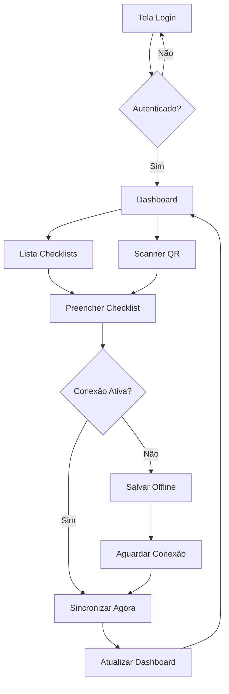

## 1. Visão Geral do Produto

Transformar o Sistema Web de Checklist de Manutenção em um aplicativo mobile Android nativo, com foco em trabalho offline robusto, sincronização automática e notificações push. O app será destinado a técnicos de manutenção que precisam realizar inspeções em campo sem dependência de conexão constante.

**Problema:** Técnicos precisam de acesso offline confiável ao sistema de checklists em ambientes com conectividade limitada.
**Solução:** App mobile com sincronização inteligente e trabalho offline completo.
**Valor:** Aumentar a produtividade e reduzir erros de preenchimento em campo.

## 2. Funcionalidades Principais

### 2.1 Papéis de Usuário

| Papel                 | Método de Registro              | Permissões Principais                                              |
| --------------------- | ------------------------------- | ------------------------------------------------------------------ |
| Técnico de Manutenção | Email + aprovação administrador | Criar e editar checklists, trabalhar offline, receber notificações |
| Supervisor            | Convite administrativo          | Visualizar relatórios, aprovar checklists, gerenciar equipe        |
| Administrador         | Cadastro direto                 | Gerenciar usuários, equipamentos, configurar notificações          |

### 2.2 Módulos de Funcionalidades

O aplicativo mobile consiste nos seguintes módulos principais:

1. **Tela de Login/Autenticação**: autenticação biométrica, login offline temporário
2. **Dashboard Mobile**: cards de checklists pendentes, status de sincronização
3. **Checklist Offline**: preenchimento completo sem conexão, fotos offline
4. **Gestão de Equipamentos**: QR code scanner, histórico de manutenções
5. **Sincronização**: controle manual e automático de dados pendentes
6. **Notificações**: lembretes de checklist, alertas de manutenção
7. **Relatórios Mobile**: visualização offline de relatórios básicos
8. **Configurações**: preferências offline, limpar cache, sobre

### 2.3 Detalhes das Funcionalidades

| Tela          | Módulo                | Descrição das Funcionalidades                                                |
| ------------- | --------------------- | ---------------------------------------------------------------------------- |
| Login         | Autenticação          | Login com email/senha, biometria, modo offline temporário, recuperar senha   |
| Dashboard     | Cards Principais      | Exibir checklists pendentes do dia, status de sincronização, atalhos rápidos |
| Dashboard     | Barra de Status       | Indicador de conexão, dados pendentes, última sincronização                  |
| Checklist     | Lista de Checklists   | Filtrar por tipo (irrigação, CCT, coque), equipamento, prioridade            |
| Checklist     | Preenchimento Offline | Marcar itens, adicionar fotos, anotações, assinatura digital                 |
| Checklist     | Finalização           | Salvar localmente, aguardar sincronização, gerar PDF offline                 |
| Equipamentos  | Scanner QR Code       | Ler código do equipamento, abrir checklist relacionado                       |
| Equipamentos  | Detalhes              | Visualizar histórico, especificações, próximas manutenções                   |
| Sincronização | Controle Manual       | Ver dados pendentes, sincronizar agora, resolver conflitos                   |
| Notificações  | Push Notifications    | Lembretes de checklist, alertas de atraso, novas atribuições                 |
| Relatórios    | Visão Geral           | Gráficos básicos offline, filtros por período/equipamento                    |
| Configurações | Offline               | Escolher dados para sincronizar, limite de armazenamento                     |

## 3. Fluxos Principais

### Fluxo do Técnico

1. Login com biometria ou credenciais
2. Visualizar checklists pendentes no dashboard
3. Selecionar equipamento via QR code ou lista
4. Preencher checklist offline com fotos e anotações
5. Salvar localmente (funciona sem internet)
6. Sincronizar quando houver conexão
7. Receber confirmação de sincronização

### Fluxo de Sincronização

1. App detecta conexão disponível
2. Verifica dados pendentes localmente
3. Envia checklists completados para servidor
4. Baixa novos checklists atribuídos
5. Atualiza status de equipamentos
6. Notifica usuário do resultado

## 4. Interface do Usuário

### 4.1 Estilo de Design

* **Cores Primárias:** Azul profissional (#1E40AF) - mantém identidade web

* **Cores Secundárias:** Verde para status positivo, vermelho para alertas

* **Botões:** Estilo Material Design 3 com elevção e sombras suaves

* **Tipografia:** Roboto para títulos, Open Sans para corpo (fontes nativas Android)

* **Layout:** Card-based com navegação inferior (bottom navigation)

* **Ícones:** Material Design Icons para consistência com Android

### 4.2 Visão Geral das Telas

| Tela          | Módulo     | Elementos de UI                                                                 |
| ------------- | ---------- | ------------------------------------------------------------------------------- |
| Login         | Formulário | Logo centralizado, campos com outlines arredondados, botão primário grande      |
| Dashboard     | Cards      | Cards com sombra suave, indicadores circulares de progresso, chips de status    |
| Checklist     | Lista      | Itens com checkbox customizado, fotos em miniatura, barra de progresso superior |
| Checklist     | Formulário | Campos adaptativos, teclado numérico para valores, camera integrada             |
| Equipamentos  | Lista      | Cards horizontais com imagem lateral, badge de status colorido                  |
| Sincronização | Status     | Lista de itens pendentes, botão de ação flutuante, progresso circular           |
| Configurações | Menu       | Lista com ícones, switches para ativar/desativar, divisóores entre grupos       |

### 4.3 Responsividade e Adaptação

* **Mobile-First:** Design otimizado para smartphones Android

* **Tabelas:** Conversão automática para cards verticais

* **Orientação:** Suporte portrait e landscape com layouts adaptativos

* **Tamanhos de Tela:** Compatível de 4.7" a 7" (phones e tablets pequenos)

* **Touch Targets:** Mínimo 48dp para todos elementos interativos

* **Gestos:** Swipe para navegar, pull-to-refresh para

