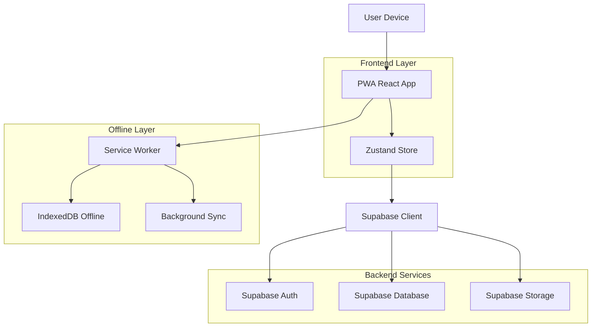
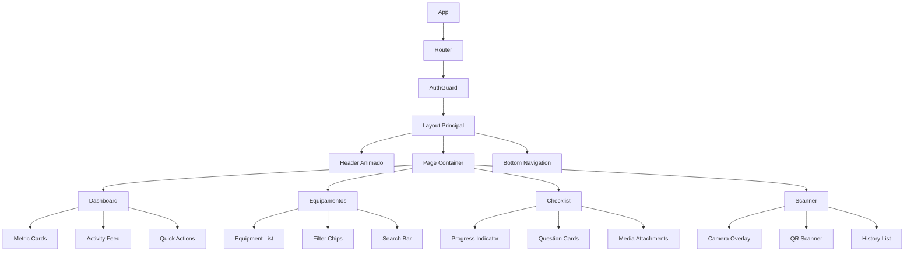

## 1. Arquitetura do Sistema



## 2. Stack Tecnológica

- **Frontend:** React 18.3+ com TypeScript 5.0+
- **Build Tool:** Vite 6.0+ com HMR ultra-rápido
- **Estado Global:** Zustand 5.0+ com persistência híbrida
- **UI Framework:** Tailwind CSS 3.4+ com animações customizadas
- **Componentes:** Headless UI + Framer Motion para animações
- **Ícones:** Lucide React com animações dinâmicas
- **PWA:** Vite PWA Plugin com Workbox 7.0+
- **Backend:** Supabase completo (Auth, Database, Storage)
- **Offline:** IndexedDB com Dexie para cache inteligente
- **QR Code:** Html5-Qrcode com AR overlay
- **Charts:** Chart.js 4.0+ com animações responsivas

## 3. Definições de Rotas

| Rota | Componente | Props | Descrição |
|------|------------|-------|-----------|
| `/` | Redirect | to: "/dashboard" | Redirecionamento inicial |
| `/login` | LoginPage | - | Tela de login moderna com biometria |
| `/dashboard` | DashboardPage | user, metrics | Dashboard com cards animados |
| `/equipamentos` | EquipamentosPage | filters, sort | Lista animada de equipamentos |
| `/equipamento/:id` | EquipamentoDetail | id, equipamento | Detalhes com QR code |
| `/checklist/:id` | ChecklistFormPage | id, checklist | Formulário interativo swipeable |
| `/scanner` | ScannerPage | - | Scanner AR com overlay moderno |
| `/relatorios` | RelatoriosPage | filters, dateRange | Gráficos animados interativos |
| `/perfil` | ProfilePage | user | Configurações modernas do usuário |
| `/sincronizacao` | SyncPage | status, conflicts | Interface de sincronização visual |
| `/showcase` | ComponentsShowcase | - | Demonstração de componentes |

## 4. Modelos de Dados

### 4.1 Tipos TypeScript Principais

```typescript
// Usuário moderno
interface Usuario {
  id: string
  email: string
  nome: string
  avatar_url?: string
  role: 'tecnico' | 'supervisor' | 'admin'
  preferencias: UserPreferences
  ultimo_acesso: string
  ativo: boolean
  created_at: string
  updated_at: string
}

interface UserPreferences {
  tema: 'auto' | 'claro' | 'escuro'
  notificacoes: boolean
  sincronizacao_automatica: boolean
  idioma: 'pt-BR' | 'en-US'
  fonte_size: 'pequena' | 'normal' | 'grande'
}

// Equipamento otimizado
interface Equipamento {
  id: string
  codigo: string // QR Code
  tipo: string
  descricao?: string
  localizacao?: string
  imagem_url?: string
  status: 'ativo' | 'manutencao' | 'inativo'
  ultima_inspecao?: string
  proxima_manutencao?: string
  qr_code_data: string
  metadados?: Record<string, any>
  ativo: boolean
  created_at: string
  updated_at: string
}

// Checklist moderno
interface Checklist {
  id: string
  titulo: string
  tipo: 'preventiva' | 'corretiva' | 'especial'
  descricao: string
  equipamento_tipo: string[]
  itens: ChecklistItem[]
  versao: number
  ativo: boolean
  created_at: string
  updated_at: string
}

interface ChecklistItem {
  id: string
  ordem: number
  descricao: string
  tipo: 'booleano' | 'texto' | 'numero' | 'opcoes' | 'foto' | 'audio'
  obrigatorio: boolean
  opcoes?: string[]
  min?: number
  max?: number
  validacao?: ValidationRule[]
}

interface ValidationRule {
  tipo: 'min' | 'max' | 'regex' | 'condicional'
  valor: any
  mensagem: string
}

// Resposta otimizada
interface RespostaChecklist {
  id: string
  checklist_id: string
  equipamento_id: string
  usuario_id: string
  data_execucao: string
  respostas: RespostaItem[]
  observacoes?: string
  anexos: Anexo[]
  status: 'rascunho' | 'completo' | 'pendente' | 'aprovado' | 'rejeitado'
  sincronizado: boolean
  versao_local: number
  created_at: string
  updated_at: string
}

interface RespostaItem {
  item_id: string
  valor: string | number | boolean | null
  observacao?: string
  anexos?: string[] // URLs das imagens
}

interface Anexo {
  id: string
  tipo: 'imagem' | 'audio' | 'video' | 'documento'
  url: string
  nome_arquivo: string
  tamanho: number
  mime_type: string
}
```

### 4.2 Esquema Supabase

```sql
-- Usuários (usa auth do Supabase)
CREATE TABLE usuarios (
  id UUID PRIMARY KEY REFERENCES auth.users(id) ON DELETE CASCADE,
  nome VARCHAR(255) NOT NULL,
  avatar_url TEXT,
  role VARCHAR(20) DEFAULT 'tecnico' CHECK (role IN ('tecnico', 'supervisor', 'admin')),
  preferencias JSONB DEFAULT '{"tema": "auto", "notificacoes": true, "sincronizacao_automatica": true, "idioma": "pt-BR", "fonte_size": "normal"}',
  ultimo_acesso TIMESTAMP WITH TIME ZONE,
  ativo BOOLEAN DEFAULT true,
  created_at TIMESTAMP WITH TIME ZONE DEFAULT NOW(),
  updated_at TIMESTAMP WITH TIME ZONE DEFAULT NOW()
);

-- Equipamentos
CREATE TABLE equipamentos (
  id UUID PRIMARY KEY DEFAULT gen_random_uuid(),
  codigo VARCHAR(100) UNIQUE NOT NULL,
  tipo VARCHAR(100) NOT NULL,
  descricao TEXT,
  localizacao VARCHAR(255),
  imagem_url TEXT,
  status VARCHAR(20) DEFAULT 'ativo' CHECK (status IN ('ativo', 'manutencao', 'inativo')),
  ultima_inspecao TIMESTAMP WITH TIME ZONE,
  proxima_manutencao TIMESTAMP WITH TIME ZONE,
  qr_code_data TEXT NOT NULL,
  metadados JSONB DEFAULT '{}',
  ativo BOOLEAN DEFAULT true,
  created_at TIMESTAMP WITH TIME ZONE DEFAULT NOW(),
  updated_at TIMESTAMP WITH TIME ZONE DEFAULT NOW()
);

-- Templates de Checklist
CREATE TABLE checklists (
  id UUID PRIMARY KEY DEFAULT gen_random_uuid(),
  titulo VARCHAR(255) NOT NULL,
  tipo VARCHAR(50) NOT NULL CHECK (tipo IN ('preventiva', 'corretiva', 'especial')),
  descricao TEXT,
  equipamento_tipo JSONB NOT NULL DEFAULT '[]',
  itens JSONB NOT NULL DEFAULT '[]',
  versao INTEGER DEFAULT 1,
  ativo BOOLEAN DEFAULT true,
  created_at TIMESTAMP WITH TIME ZONE DEFAULT NOW(),
  updated_at TIMESTAMP WITH TIME ZONE DEFAULT NOW()
);

-- Respostas dos checklists
CREATE TABLE respostas_checklist (
  id UUID PRIMARY KEY DEFAULT gen_random_uuid(),
  checklist_id UUID REFERENCES checklists(id),
  equipamento_id UUID REFERENCES equipamentos(id),
  usuario_id UUID REFERENCES usuarios(id),
  data_execucao TIMESTAMP WITH TIME ZONE NOT NULL,
  respostas JSONB NOT NULL DEFAULT '[]',
  observacoes TEXT,
  anexos JSONB DEFAULT '[]',
  status VARCHAR(20) DEFAULT 'rascunho' CHECK (status IN ('rascunho', 'completo', 'pendente', 'aprovado', 'rejeitado')),
  sincronizado BOOLEAN DEFAULT false,
  versao_local INTEGER DEFAULT 1,
  created_at TIMESTAMP WITH TIME ZONE DEFAULT NOW(),
  updated_at TIMESTAMP WITH TIME ZONE DEFAULT NOW()
);

-- Índices para performance
CREATE INDEX idx_equipamentos_codigo ON equipamentos(codigo);
CREATE INDEX idx_equipamentos_tipo ON equipamentos(tipo);
CREATE INDEX idx_equipamentos_status ON equipamentos(status);
CREATE INDEX idx_checklists_tipo ON checklists(tipo);
CREATE INDEX idx_checklists_ativo ON checklists(ativo);
CREATE INDEX idx_respostas_usuario ON respostas_checklist(usuario_id);
CREATE INDEX idx_respostas_equipamento ON respostas_checklist(equipamento_id);
CREATE INDEX idx_respostas_data ON respostas_checklist(data_execucao);
CREATE INDEX idx_respostas_status ON respostas_checklist(status);
CREATE INDEX idx_respostas_sincronizado ON respostas_checklist(sincronizado);

-- Políticas de segurança RLS (Row Level Security)
-- Permitir leitura pública de checklists ativos
ALTER TABLE checklists ENABLE ROW LEVEL SECURITY;
CREATE POLICY "Checklists ativos são públicos" ON checklists
  FOR SELECT USING (ativo = true);

-- Usuários podem ver apenas seus próprios dados
ALTER TABLE usuarios ENABLE ROW LEVEL SECURITY;
CREATE POLICY "Usuários veem próprio perfil" ON usuarios
  FOR SELECT USING (auth.uid() = id);
CREATE POLICY "Usuários atualizam próprio perfil" ON usuarios
  FOR UPDATE USING (auth.uid() = id);

-- Equipamentos visíveis para todos autenticados
ALTER TABLE equipamentos ENABLE ROW LEVEL SECURITY;
CREATE POLICY "Equipamentos visíveis para autenticados" ON equipamentos
  FOR SELECT USING (auth.role() = 'authenticated');

-- Respostas próprias e do time (hierarquia)
ALTER TABLE respostas_checklist ENABLE ROW LEVEL SECURITY;
CREATE POLICY "Ver respostas próprias" ON respostas_checklist
  FOR SELECT USING (auth.uid() = usuario_id);
CREATE POLICY "Supervisor vê do time" ON respostas_checklist
  FOR SELECT USING (
    auth.uid() IN (
      SELECT id FROM usuarios WHERE role = 'supervisor'
    )
  );
CREATE POLICY "Criar respostas" ON respostas_checklist
  FOR INSERT WITH CHECK (auth.uid() = usuario_id);
CREATE POLICY "Atualizar respostas próprias" ON respostas_checklist
  FOR UPDATE USING (auth.uid() = usuario_id);
```

## 5. Arquitetura de Componentes

### 5.1 Hierarquia de Componentes



### 5.2 Componentes Reutilizáveis

```typescript
// Componentes base modernos
interface ModernCardProps {
  children: React.ReactNode
  className?: string
  animation?: 'fadeIn' | 'slideUp' | 'scale'
  hover?: boolean
  glass?: boolean
}

interface AnimatedButtonProps {
  variant: 'primary' | 'secondary' | 'success' | 'warning' | 'error'
  size: 'sm' | 'md' | 'lg'
  loading?: boolean
  icon?: React.ReactNode
  children: React.ReactNode
  onClick: () => void
  fullWidth?: boolean
  disabled?: boolean
}

interface SwipeableCardProps {
  children: React.ReactNode
  onSwipeLeft?: () => void
  onSwipeRight?: () => void
  onSwipeUp?: () => void
  threshold?: number
  className?: string
}

interface FloatingLabelInputProps {
  label: string
  type: 'text' | 'email' | 'password' | 'number' | 'tel'
  value: string
  onChange: (value: string) => void
  error?: string
  required?: boolean
  disabled?: boolean
  icon?: React.ReactNode
}
```

## 6. Performance e Otimização

### 6.1 Estratégias de Performance

- **Code Splitting:** Lazy loading por rotas e componentes pesados
- **Image Optimization:** WebP com fallback, lazy loading nativo
- **Bundle Analysis:** Webpack Bundle Analyzer para monitoramento
- **Caching Strategy:** Service Worker com estratégias específicas por tipo de dado
- **Tree Shaking:** Eliminação de código morto com ES modules
- **Minification:** Terser para JavaScript, CSSO para estilos

### 6.2 Métricas de Performance

- **First Contentful Paint:** < 1.5s
- **Largest Contentful Paint:** < 2.5s
- **First Input Delay:** < 100ms
- **Cumulative Layout Shift:** < 0.1
- **Time to Interactive:** < 3.5s
- **Bundle Size:** < 200KB inicial, < 1MB total

## 7. Segurança e Privacidade

### 7.1 Medidas de Segurança

- **Autenticação:** JWT com refresh tokens, biometria nativa
- **Autorização:** RBAC com hierarquia (técnico → supervisor → admin)
- **Criptografia:** TLS 1.3, dados sensíveis criptografados no client
- **Validação:** Input validation em todas as camadas
- **Rate Limiting:** Supabase RLFs para prevenir abuso
- **Audit Logging:** Registro de todas as ações críticas

### 7.2 Conformidade

- **LGPD:** Consentimento explícito, direito ao esquecimento
- **GDPR:** Portabilidade de dados, privacidade por design
- **Accessibility:** WCAG 2.1 AA completo
- **PWA:** Manifesto completo, installable, offline-first

## 8. Monitoramento e Analytics

### 8.1 Métricas de Negócio

- Tempo médio de checklist
- Taxa de sincronização
- Disponibilidade offline
- Satisfação do usuário (NPS)
- Taxa de erro por tipo

### 8.2 Métricas Técnicas

- Performance Core Web Vitals
- Taxa de crash/freeze
- Tempo de resposta da API
- Taxa de sucesso de sincronização
- Uso de memória e bateria