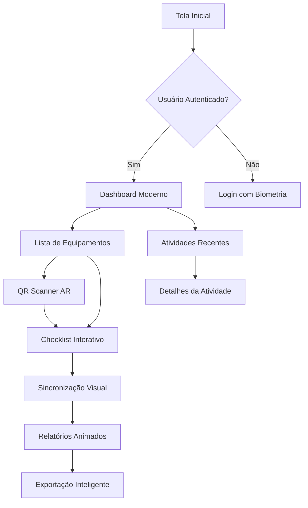

## 1. Visão Geral do Produto

Aplicação mobile-first de checklists industriais para inspeção e manutenção de equipamentos. Resolve problemas de gestão de manutenção preditiva, permitindo que técnicos realizem inspeções offline/online com sincronização automática.

**Valor de Mercado:** Otimização de processos de manutenção industrial, redução de falhas de equipamentos e aumento da segurança operacional.

## 2. Funcionalidades Principais

### 2.1 Papéis de Usuário

| Papel            | Método de Registro      | Permissões Principais                                             |
| ---------------- | ----------------------- | ----------------------------------------------------------------- |
| Técnico de Campo | Convite via email/admin | Criar e executar checklists, escanear QR codes, sincronizar dados |
| Supervisor       | Convite via admin       | Visualizar relatórios, aprovar checklists, gerenciar equipamentos |
| Administrador    | Registro direto         | Acesso completo: usuários, equipamentos, templates, relatórios    |

### 2.2 Módulos de Funcionalidades

Nosso aplicativo de checklists moderno consiste nas seguintes páginas principais:

1. **Tela Inicial/ Dashboard**: Visão geral com cards animados, status de sincronização, atividades recentes
2. **Lista de Equipamentos**: Cards expansivos com QR code, status visual, filtros avançados
3. **Checklist Interativo**: Interface com swipe gestures, animações fluidas, validação em tempo real
4. **Scanner Inteligente**: Leitura de QR codes com realidade aumentada, histórico rápido
5. **Relatórios Animados**: Gráficos interativos, exportação inteligente, filtros dinâmicos
6. **Perfil do Usuário**: Configurações modernas, tema dinâmico, preferências de trabalho
7. **Sincronização**: Interface com progresso visual, conflitos inteligentes, backup automático

### 2.3 Detalhamento das Páginas

| Nome da Página | Módulo                 | Descrição das Funcionalidades                                                                                    |
| -------------- | ---------------------- | ---------------------------------------------------------------------------------------------------------------- |
| Dashboard      | Cards de Status        | Exibir métricas animadas com gradientes modernos, transições suaves e informações de sincronização em tempo real |
| Dashboard      | Atividades Recentes    | Listar últimas inspeções com animação de entrada, filtros por data e status com transições fluidas               |
| Dashboard      | Ações Rápidas          | Botões flutuantes com animações de escala, acesso rápido a scanner e novo checklist                              |
| Equipamentos   | Lista Animada          | Cards com efeito parallax, lazy loading de imagens, pull-to-refresh nativo                                       |
| Equipamentos   | Filtros Inteligentes   | Filtros com chips animados, busca em tempo real com debounce, ordenação dinâmica                                 |
| Equipamentos   | QR Code Scanner        | Câmera com overlay moderno, leitura rápida, animação de sucesso/erro                                             |
| Checklist      | Interface Interativa   | Swipe entre perguntas, animações de progresso, validação com microinterações                                     |
| Checklist      | Tipos de Respostas     | Toggle switches modernos, dropdowns animados, campos com validação visual instantânea                            |
| Checklist      | Anexos Multimídia      | Preview de imagens com zoom, gravação de áudio com waveform, upload com drag & drop                              |
| Relatórios     | Gráficos Animados      | Gráficos interativos com Chart.js, animações de entrada, filtros dinâmicos                                       |
| Relatórios     | Exportação             | Botões com estados de loading, preview antes de exportar, múltiplos formatos                                     |
| Perfil         | Configurações Modernas | Toggle switches animados, tema claro/escuro automático, preferências persistentes                                |
| Sincronização  | Status Visual          | Progress bar animado, indicadores de conflito, resolução intuitiva de conflitos                                  |

## 3. Fluxos Principais

### Fluxo do Técnico

1. Login biométrico/QR → Dashboard com métricas animadas
2. Selecionar equipamento → Visualizar histórico → Iniciar checklist
3. Responder perguntas com gestos → Anexar evidências → Finalizar com animação
4. Sincronizar automaticamente → Visualizar confirmação com sucesso

### Fluxo do Supervisor

1. Dashboard administrativo → Acessar relatórios filtrados
2. Analisar métricas em tempo real → Identificar anomalias
3. Aprovar/reprovar checklists → Adicionar comentários
4. Gerar relatórios executivos → Exportar com branding

## 4. Design de Interface

### 4.1 Estilo Visual Moderno

**Cores Principais:**

* Primária: Gradientes dinâmicos (azul-profissional #3B82F6 → índigo-escuro #1E3A8A)

* Secundária: Verde-sucesso (#10B981) para status positivos

* Alertas: Laranja-dinâmico (#F59E0B) para atenção, Vermelho-modern (#EF4444) para erros

* Neutros: Paleta de cinzas sofisticada (slate-50 ao slate-900)

**Elementos Visuais:**

* Botões: Rounded-xl com sombras suaves, efeitos de hover com scale(1.02)

* Tipografia: Inter para headers, system-ui para corpo, hierarquia clara

* Layout: Card-based com bordas arredondadas, espaçamento generoso

* Animações: Framer-motion para transições complexas, CSS para microinterações

* Ícones: Lucide React com peso consistente, animações de entrada

**Componentes Modernos:**

* Glassmorphism para cards principais com backdrop-blur

* Neumorphism sutil para botões de ação primária

* Skeleton loading com shimmer effect animado

* Toast notifications com swipe-to-dismiss

* Bottom sheet para ações contextuais

### 4.2 Design Responsivo Mobile-First

| Dispositivo         | Colunas                       | Espaçamento              | Tipografia                    |
| ------------------- | ----------------------------- | ------------------------ | ----------------------------- |
| Mobile (< 640px)    | Single column, 100% width     | 1rem padding, 0.5rem gap | 14-18px base, 24-32px headers |
| Tablet (640-1024px) | 2 colunas para listas         | 1.5rem padding, 1rem gap | 16-20px base, 28-40px headers |
| Desktop (> 1024px)  | 3-4 colunas, max-width 1200px | 2rem padding, 1.5rem gap | 18-22px base, 32-48px headers |

**Otimizações Touch:**

* Touch targets mínimos de 48x48px

* Swipe gestures naturais (esquerda/direita entre perguntas)

* Pull-to-refresh com animação elástica

* Haptic feedback em ações críticas

* Teclado numérico automático para campos numéricos

### 4.3 Acessibilidade Premium

* WCAG 2.1 AA compliance completo

* Dark mode automático baseado em system preferences

* Font scaling respeitando configurações do sistema

* VoiceOver/TalkBack otimizado com labels descritivos

* Navegação por teclado completa em desktop

* Focus indicators visuais e animados

* Color contrast ratio mínimo 4.5:1

* Animações respeitando prefers-reduced-motion

### 4.4 Performance e Experiência

* PWA com offline-first completo

* Lazy loading agressivo de componentes

* Image optimization com WebP e lazy loading

* Bundle splitting por rotas

* Cache estratégico com Workbox

* Loading states perceptivos em todas as interações

* Instant transitions com optimistic UI

* Error boundaries elegantes com retry automático

